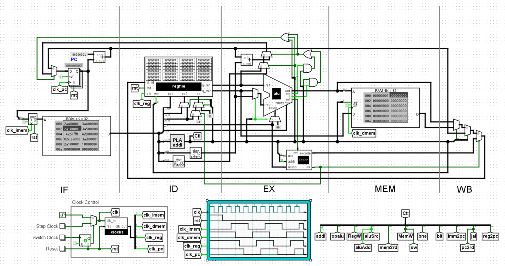
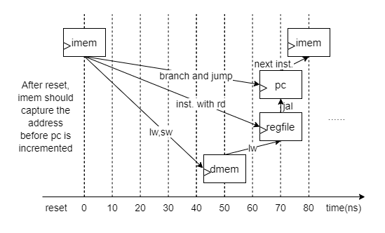
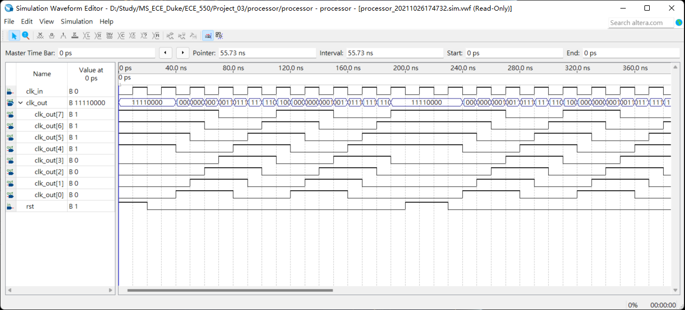
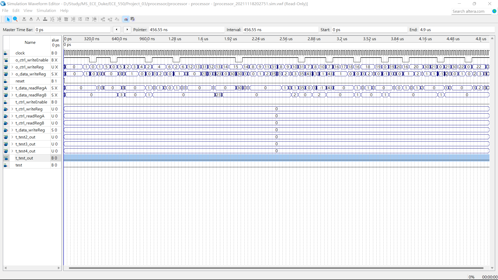

# Processor - Checkpoint 2

## 👨‍💻 Group Members

|Name|NetID|
|---|---|
|Guangxuan Li|gl137|
|Zhigang Wei|zw261|


## 📝 Description

### 🎄 Module tree

```bash
skeleton
├───clocks
├───imem
├───dmem
├───regfile
│   └───dffe_wers
└───processor
    ├───dffe_wers
    ├───randlogic
    ├───alu
    └───exception_gen
```


### 🖼️ The BIG picture




### 🕒 Clocks

Here are some of the data dependencies in a single cycle that affects the design of clock signals.



Note that in jal instruction, regfile should latch up the value from pc not later than when pc is updated.

With the carefully designed clock generator, we have 8 12.5MHz clock signals. After every async reset, the delay between the clocks are always the same. Also, `clk_out[0]` will always give the first posedge after reset. This makes the fine-grained timing control over the processor possible.



At this point, the clocks of our design is as follows:

| Name            | Frequency | Trigger | Offset | Duty Cycle |
| --------------- | --------- | ------- | ------ | ---------- |
| imem_clock      | 12.5MHz   | posedge | 0ns    | 50%        |
| dmem_clock      | 12.5MHz   | posedge | 50ns   | 50%        |
| regfile_clock   | 12.5MHz   | posedge | 50ns   | 50%        |
| processor_clock | 12.5MHz   | posedge | 70ns   | 50%        |


## ✔️ Checklist

- [x] config.v: some useful macros for the project.
- [x] clocks.v: generates 8 12.5MHz clock signals from the 50MHz input clock.
- [x] imem.v: instruction memory, generated by Quartus.
- [x] dmem.v: data memory, generated by Quartus.
- [x] regfile.v: register file.
- [x] dffe_wers.v: D flip-flop with write enable and asynchronous reset.
- [x] processor.v: the BIG picture written in Verilog.
- [x] randlogic.v: random logic that generated datapath control signals from opcode.
- [x] alu.v: arithmetic logic unit.
- [x] exception_gen.v: generates the exception signal and exception code.


## 📈 Timing Simulation Waveform



## 🐞 Bugs and Issues

* The BIG picture have some unfixed bugs, and it would be very hard to connect the lines. Please refer to the source code for implementation details.
* The processor uses ripple-carry adder for every addition operation. According to the book "Computer Arithmetic: Algorithms and Hardware Designs", carry-skip adders would have less latency on FPGAs, which may give higher max frequency.
* The clock offsets between different modules can be further fine-tuned to achieve higher max frequency.
