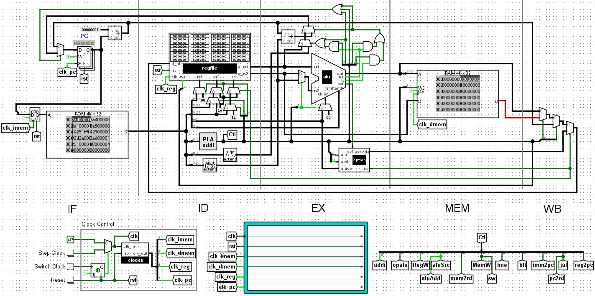

# Processor - Checkpoint 1

## 👨‍💻 Group Members

|Name|NetID|
|---|---|
|Guangxuan Li|gl137|
|Zhigang Wei|zw261|


## 📝 Description

### 🎄 Module tree

```bash
skeleton
├───clocks
├───imem
├───dmem
├───regfile
│   └───dffe_wers
└───processor
    ├───dffe_wers
    ├───randlogic
    ├───alu
    └───exception_gen
```


### 🖼️ The BIG picture




### 🕒 Clocks

Here are some of the data dependencies in a single cycle that affects the design of clock signals.


With the carefully designed clock generator, we have 8 12.5MHz clock signals. After every async reset, the delay between the clocks are always the same. Also, `clk_out[0]` will always give the first posedge after reset. This makes the fine-grained timing control over the processor possible.


At this point, the clocks of our design is as follows:

| Name            | Frequency | Trigger | Offset | Duty Cycle |
| --------------- | --------- | ------- | ------ | ---------- |
| imem_clock      | 12.5MHz   | posedge | 0ns    | 50%        |
| dmem_clock      | 12.5MHz   | posedge | 50ns   | 50%        |
| regfile_clock   | 12.5MHz   | posedge | 60ns   | 50%        |
| processor_clock | 12.5MHz   | posedge | 70ns   | 50%        |


### ✔️ Checklist

- [x] config.v: some useful macros for the project.
- [x] clocks.v: generates 8 12.5MHz clock signals from the 50MHz input clock.
- [x] imem.v: instruction memory, generated by Quartus.
- [x] dmem.v: data memory, generated by Quartus.
- [x] regfile.v: register file.
- [x] dffe_wers.v: D flip-flop with write enable and asynchronous reset.
- [x] processor.v: the BIG picture written in Verilog.
- [x] randlogic.v: random logic that generated datapath control signals from opcode.
- [x] alu.v: arithmetic logic unit.
- [x] exception_gen.v: generates the exception signal and exception code.


## 🐞 Bugs and Issues

* The following instructions are disabled for this checkpoint, but the datapaths are implemented, you can enable them by de-commenting them in `randlogic.v`:

  ```assembly
  j
  bne
  jal
  jr
  blt
  ```

  

* The following instructions are not implemented right now:

  ```assembly
  setx
  bex
  ```
